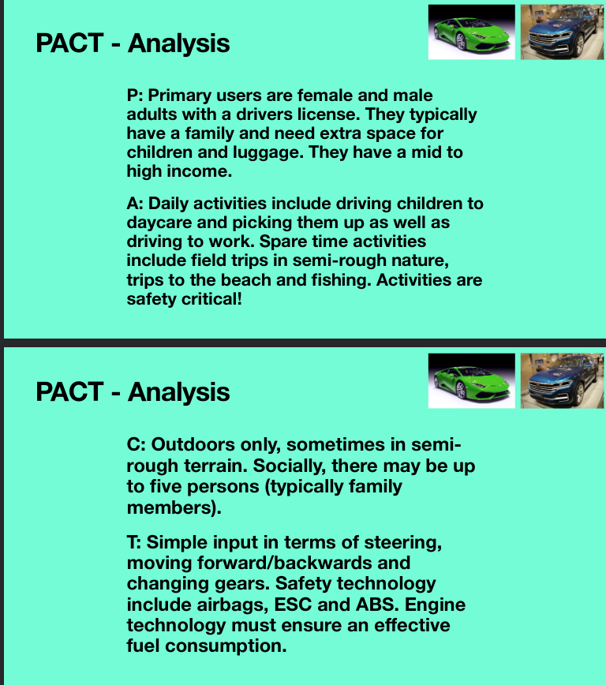

# Introduction
For this session, you will do 2 reviews. Once for a system that led to a poor experience and another that led to a good experience:

1. select one system with which you have had a poor experience (web application, desktop application, mobile app etc.) and consider the following while using the concepts from PACT:

- What is the aim of the system?
- Who are the target users?
- What activities is the system supposed to support, and in which context(s)?
- Why did the use of the system lead to a poor experience?
- How would you improve this?

2. select one system with which you have had a good experience (web application, desktop application, mobile app etc.) and consider the following while using the concepts from PACT:

- What is the aim of the system?
- Who are the target users?
- What activities is the system supposed to support, and in which context(s)?
- Why did the use of the system lead to a good experience?
- How could you improve this further?

Perhaps start with bullet points on the whiteboard/blackboard. Discuss and then refine the writing and use google docs or another way to capture this digitally. Aim for 1/2 page of text for each. Be ready to discuss with the teaching assistants who will be circulating during this time.

# Bad Experience
[MentorPortalen](https://mentorportal.mentordanmark.dk/) is my bad system of choice.

The aim of the system is to be a hub for Mentors at MentorDanmark to have access to everything that is related to their job.

The target users are mentors at MentorDanmark. This would be mostly young people in average age is probably 18-22. To get hired you also have to somewhat good grades.

The system is a place for mentors at MentorDanmark to get their news about the company get resources for education both for themselves and for the people they are mentoring. However the most important aspect of the site is Forløbsportalen where mentors can write down what they have done with their mentee, this has to be done in order to get paid.

Most of the site is pretty good however their are a small problem and a big one. The small problem is that the first thing you are greeted with is a login screen however, this login screen does not play nicely with password managers,. You have to at the very least edit a single character in the password field in order to login. This is only a minor annoyance, but seeing as this is the first thing you are greeted with it does not give a good first impression. However the worst part is that Forløbsportalen is made for phones, which leads to a very poor experience on a pc. There are lots of swiping motions time input does not really work either, and only one third of the screen is actually showing any content.

Improvements seem pretty self evident.

# Good Experience
My good system of choice is Discord.

The aim of the system is to be a community centred application where similar minded people or friends con communicate through text or videochat.

Originally the target audience were people who are into gaming, although discord has tried to expand on this. Most of the users now are still mostly into tech, youtube, gaming or something similar. People who mostly use social media such as instagram and the like will probably not be users of discord as well.

Discord has support for a lot of things although primarily communication. One way that discord stands out is the ability to customize your communities you can have many text/voice channels, you can create a hierarchy in the community members such that some people have more rights in the community than others, that way you might be able to have a presentation without the audience interrupting you. You can also use bots that can automate certain things for such a play music roll dice or something else.

Mainly the ease of use plus structure you can create using the costumization. This allows for very organized communities such as a study group.

There are some small things that could be approved upon such as screen sharing on Linux with multiple monitors does not work properly. However a more reasonable fix might be that the UI easily gets cluttered when you zoom in, which is definitely something you need to do if you have poor eyesight.

# PACT Analysis - Example
PACT: People, Activities, Context and Technology.

