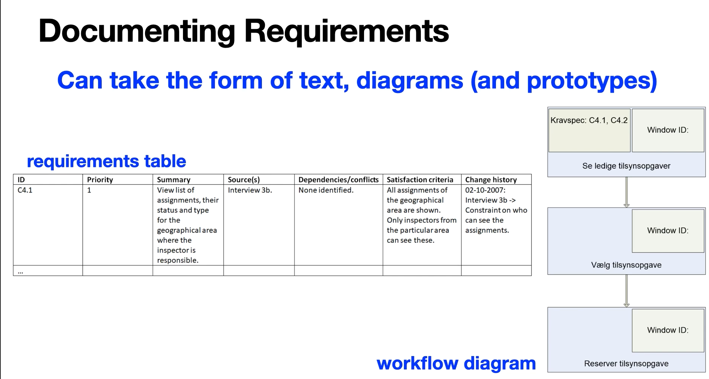
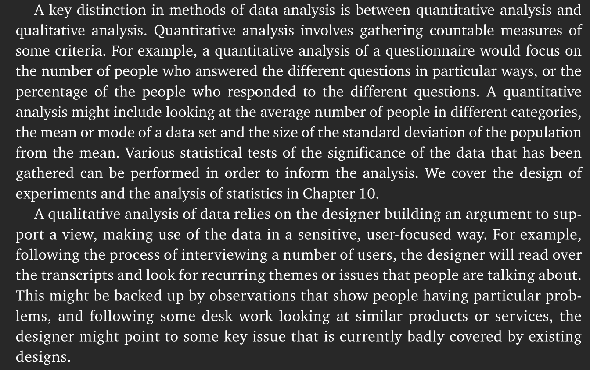

# Requirements
### Exercise 1:
What types of requirements exist?

>Conventionally, requirements are divided into two types: functional and non-functional. Functional requirements are what the system must do; non-functional requirements are the qualities that the system must have. These qualities may be crucial factors in the acceptability, sales or usage of a product. Non-functional requirements cover a number of aspects of design, including image and aesthetics, usability, UX, performance, maintainability, security, cultural acceptability and legal restrictions.

### Exercise 2:
What characterizes the different types of requirements?

Hopefully referring to MoSCoW.
>
> - **Must have**: Fundamental requirements without which the system will be unworkable and useless, effectively the minimum usable subset.
> - **Should have**: Would be essential if more time were available, but the system will be useful and usable without them.
> - **Could have**: Of lesser importance, therefore can more easily be left out of the current development.
> - **Want to have but Won't have this time round**: Can wait until a later development.

### Exercise 3:
How can requirements be represented in a requirements specification?

- requirements table
- workflow diagram
- prototypes

### Exercise 4:
What characterizes a "good" requirement? How should a good requirement be phrased?

A requirement must be testable, needs to be specific in such a way that the requirement can not be interpreted in different ways.

### Exercise 5:
How can requirements be prioritized?

Definitely MoSCoW.

### Exercise 6:
Who decides which priority to give the requirements? And how is this decided?

Should be the users combined with the developers. However, it will most likely be a combination of users, developers and the people paying for the system.

# Data Collection

### Qualitative and quantitative

### Exercise 1:
Which of the following are considered qualitative data collection methods?

- [x] Interviews
- [ ] Questionnaires
- [x] Cultural probes
- [x] Observation

Why?

All of these will involve quite a small number of people and they require the interviewer to make a case afterwards.

### Exercise 2:
Which of the following are considered quantitative data collection methods?

- [ ] Interviews
- [x] Questionnaires
- [ ] Cultural probes
- [ ] Observation

Why?

In a questionnaire you typically have to answer within some finite answer set, which means that when we have a lot of answers we can start making assumptions from this.

### Exercise 3:
Which of the following can be considered both quantitative and qualitative data collection methods?

- [x] Interviews
- [x] Questionnaires
- [ ] Cultural probes
- [ ] Observation

Why?

In an interview the interviewer can make the questions beforehand and thus make questions that are on a scale.

For questionnaires you can still end up in a situation where you need to make an argument. Maybe the people who took the questionnaire where biased in some way.

### Exercise 4:
What would be the best data collection method for gathering data in this situation: Your informants are part of a different community than your own. You want to get an understanding of their everyday lives and habits in using technologies at home. Which method of data collection techniques would be most suitable?

- [x] Interviews
- [ ] Questionnaires
- [ ] Cultural probes
- [x] Observation

Why?

All of them could be quite useful in some ways but, interviews and observation would probably be the best. An interview is a good starting point to confirm some of your initial thoughts and get a basic understanding of how everything fits together. Then an observation would prove good to get some of the small details that were missed in the interview.

### Exercise 5:
How many forms of interviews are there and how would you describe these?

**Structured:** You have your questions prepared beforehand an you will follow them quite rigorously.

**Semi-structured:** You have prepared some questions beforehand, but you can go on tangents if something comes up.

**Unstructured:** Little to no questions.

### Exercise 6:
What are the benefits and drawbacks of the different interview forms?

Prepared questions makes sure that you get the information that you wanted however, following up on tangents might lead to answers that you did not know that you wanted.

### Exercise 7:
What are some considerations you should take into account in terms of the language of interview questions, i.e. formulating questions?

Depends on the goal an open question might lead to a longer more qualitative answer, but it might not be exactly what you wanted.

### Exercise 8:
What are some benefits of observations compared to interviews?

The interviewee might feel more comfortable in their working environment. You might also get to see how things are actually done compared to how people are saying that it should be done.

### Exercise 9:
In which situations would it be most suitable to use questionnaires over interviews?

When there are many people or when you should be able to get through it quite quickly.

### Case 1: Data gathering in a hospital ward
Imagine the following use context for a software system: Nurses and doctors work together in a hospital ward where children with serious illnesses (e.g. acute respiratory symptoms) are being treated. The ward is filled with technical equipment. The children come in with their parents, and the staff need to both treat the childrens’ health conditions and consult and update their systems with information while also calming the children and informing their parents about the procedures.

You need to design a mobile app which shows a dashboard overview of data from various sensors (such as an electrocardiogram for monitoring heart rate). This is used to monitor the health of the children and warn staff about a change in physical conditions of the children in this use context.

Conduct a PACT-analysis of this scenario.

**People:** From the description only the staff of the staff

**Activities in context:** The app has to be used while nursing the children, monitoring their health and talking to the parents.

**Technology:** Mobile app

Not really a PACT-analysis, but good enough.

Which of the following data collection techniques would you find suitable for gaining an understanding of the use context?
- [x] Interviews
- [ ] Focus group interviews
- [ ] Questionnaires
- [ ] Cultural probes
- [x] In site observation
- [ ] Artefact collection
- [x] Usability evaluation

* Why these data collection techniques?

    Interviews always seem to be a good idea, it is the easiest way to get a lot of high quality information.

    Following up on the interview an observation would be good to see everything in action as the situation might be a little chaotic to describe properly.

    Usability of the application is of high importance, especially when things can get a little hectic.

* Who would you include in the data collection and in what activities?

    Seeing as the description only alludes to the fact that the staff has to look at and use the app, they should probably be the only ones.

* Are there any of the techniques that you would not use in this context and why not?

    Cultural probes seem like a bad idea staff members already have enough to deal with, so results would probably be quite poor.

* If you choose to conduct observations, which ethical issues would you consider in this specific situation?

    Seeing personal information about the children and the fact that it might be a little of putting for the parents to see someone running behind the staff taking notes.

* If you choose to conduct artefact collection, which ethical issues would you consider in this specific situation?

* If you choose to interview a doctor, what practical considerations would you take into account?

    Do not really know what is meant with practical considerations.

* If you choose to interview a child, what practical considerations would you take into account?

### Practical exercise 1:
Split the project group in two subteams (teams do not need to be the same sizes). Within each subteam you must select one interviewer and one interviewee. The interview must be at least 15 minutes. The purpose is to gain insights into the interviewees' use of smartphones and the impact of such use on everyday life. All other subteam members take notes during the interviews. After 15 minutes, you meet again in the project group and, based on the notes, identify commonalities in findings between the two subteams.
