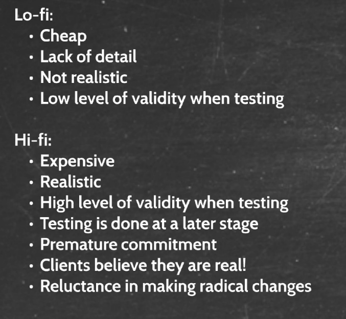

# Envisionment
### Exercise 1
What is the main purpose of the envisionment phase in a software development project?

To find out whether or not we are going in the right direction. We can write and think but, in most situations we can think of everything, and without envisioment small details and flaws will get go unnoticed, which is not great as we want to find these things as early in the development process as possible.

To translate our ideas into something that we can evaluate together with the client.

### Exercise 2
Why is it important to go through the envisioment phase?

See exercise 1.

It is an important aspect to create a valuable evaluation.

### Exercise 3
How does envisionment support requirements elicitation?

We can test whether or not this meets our requirements with the users. Users likely won't be able to give proper answers unless we have some form of envionment.

### Exercise 4
Name at least five envisionment techniques, explain the different techniques, and when they are most likely to be used in the design process.

Let me be preface by saying that the information in chapter 8 of deb book is much better.

1. Storyboard: Can be to get a general idea of the situation. How, when and why the user might do as they do. Could probably used when pitching the idea.
2. Moodboard: Can be used very early on in the design phase when we want to know how the product should feel. Feel by association.
3. Sketch: An easy way to quickly make a lot of designs for how the product could possibly look. Easy to create and easy to throw away.
4. Wireframes: A little more advanced than sketches. Can be used once you have decided on a overall structure however, they still won't be incredibly detailed.
5. Prototypes: Prototypes can be used to get some insightful user feedback and the experience of using the system as a whole and not just the look are general feel of the application.

### Exercise 5
In which part of the design and development process would you use a tool like Balsamiq and why?

After we know what it is supposed to be built functionality wise and mood wise. When is the application supposed to be used an what hardware, things like that.

### Exercise 6
What elements of a design do you focus on in lo-fi prototyping?

Interaction. If interaction was not the main focus you might as well have used a sketch. The testee should be able to get a general feel for the application interaction and looks.

### Exercise 7
How would you explain the difference between lo-fi and hi-fi prototyping?

The amount of time and detail used.

Also this:

### Exercise 8
What could be some disadvantages of developing hi-fi prototypes too early in the envisionment phase?

You spend a lot of time on it, which could be wasted as you might have misunderstood something from the user, or they might just not like it. Furthermore you now might have some commitment to seeing as you have spend a lot of time on it, and would be reluctant to start over.

### Exercise 9
What is the fundamental difference between a sketch and a prototype?

Interaction.

### Exercise 10
What are the benefits of user sketching?

You get a better idea of what the user wants, as well as a lot of input if at least if there are a lot of users.

# Cases
### Second hand non-profit webshop
You are helping a non-profit organisation that works with handling and distributing donated items, examples are clothes, shoes, bags, furniture, and kitchen supplies. They want help with the overall design of a website. They want to make sure that all the items are categorised and easy to distinguish.

- How would you structure the envisionment phase?
- Which techniques would you use and why?
- Lastly, using Balsamiq, try to envision the design of the website, discuss the different elements, and how and why you have chosen this design.

Seeing as though this is not a new concept finding other sites which have a similar purpose would be a quick way to see what the customer likes while still giving them a prototype that is incredibly detailed. Getting the users feedback on these you can start to make your own sketches with the elements that they like, and then move on to prototypes which have a similar navigational structure to the sites that they liked.

### Touchscreen for ordering food
You are going to develop a software application for a large touchscreen which enables customers to place and pay orders at a fast-food restaurant.

Individually, make 3 design alternatives (use pen and paper) of the graphical user interface for each of these three steps in the interaction sequence:

1. browsing menu items
2. selecting menu items
3. payment

- Take a look at each other’s sketches to compare and evaluate designs. Select one sketch for each of the three steps. Feel free to redo your sketches if you want to make improvements. Justify your choice.
Draw a navigational diagram to illustrate the structure of your application
- Use Balsamiq to create wireframes of your design based on your paper sketches
- Use Balsamiq to create an interactive prototype of your application based on your wireframes
- Ask a member from another group (in your cluster) to try out and evaluate your prototype. Include user sketching to provide design feedback.
