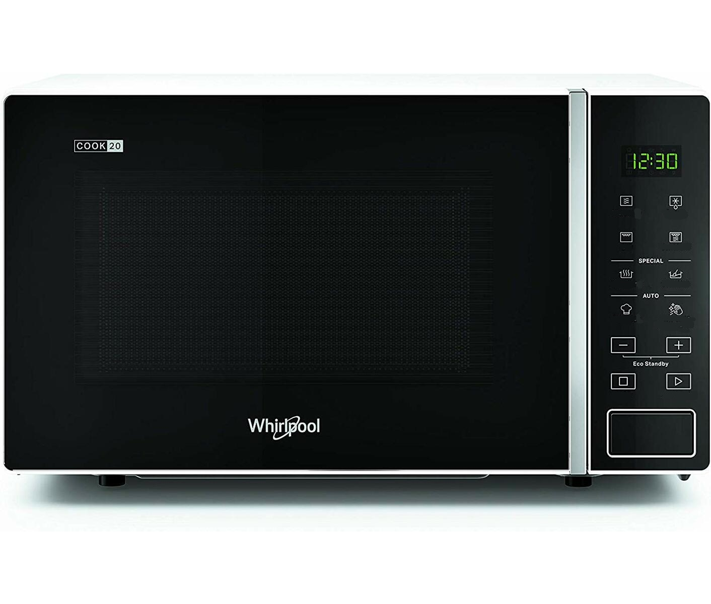
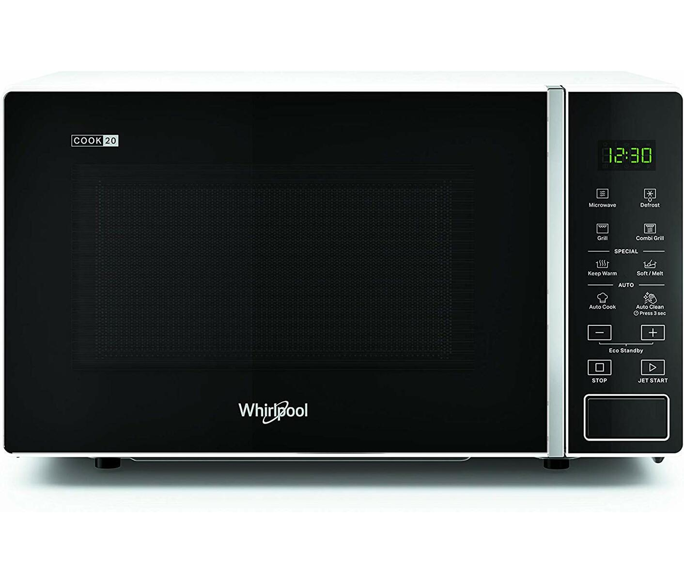

# Physical design
### What is a design widget?
A widget seem to be component that the user can interact with such as radio buttons, drop-down menus, toolbars, etc.

Might also just a some small component that encapsulates something. A progress bar might be a widget as well.

### List and explain 10 design widgets known from web application user interfaces
Not really 10 but close enough.

- Radio button

    Exclusive choice you have to pick one of the options and only one.

- Checkboxes

    You can pick any or multiple of the options.

- Drop-down menu

    Like radio buttons but this time it is a list.

- text field

    Regular text field which the user can fill in however they deem appropriate.

- number field

    A field which only allows numbers, most likely also has increment and decrement buttons.

- date field

    Pick a date from a simple calendar interface.

- password

    Text filed which has to be validated for certain criteria, often length and character choice.

- toolbar

    A menu of tools and icons that represent tools.

- slider

    A range slider that represents something that can be incremented and decremented mostly likely a number.

### List and explain 5-7 design widgets known from mobile user interfaces.
These are most likely very much the same.

A slider in this context could also be used as confirmation of something such a payment.

### Exercise 4
Nielsen's heuristic “Consistency and Standards” states that user interface designers should express the same type of design elements (e.g. radio button widgets) in the same way across designs. This heuristic also implies that designed elements should conform to platform interface conventions. Which of the following notions is used to explain why humans can readily perceive the affordance of standardized design elements? (select one option and explain this concept).

- [x] Visual cues
- [ ] Perceptual set
- [ ] Interactivity

We get most things through our eyes. Something along those lines.

### Exercise 5
Nielsen’s heuristic “Match between system and the real world” states that the system should speak the users’ language, with words, phrases, and concepts familiar to the user, rather than system-oriented terms.

- Find examples of good design metaphors that borrow concepts from “the real world” (one example per group member).
    - Credit card forms are usually in the shape of a credit card
    - Mobile applications often use a slider for confirmation instead of a pop up message
    - Calendar inputs often look like an actual calendar
- Find examples of bad user interface design that fail to match system interactions with real-world concepts, leading to misinterpretation (one example per group member).
- Discuss the examples in detail – what characterizes a good/bad design metaphor?

### Exercise 6
Nielsen’s heuristic “Flexibility and efficiency of use” states a demand for less interactions that allow faster navigation.

- In the group, find one example of an inflexible/inefficient system that requires unnecessary interactions.
    - Can not really think of any on the spot
- Redesign the user interface in order to optimize the flexibility and efficiency of the system.

### Exercise 7
Find a system that you find to be a badly designed system (could for instance be the same system you chose for the exercise in the DEB1 session).

- List specific design elements that do not adhere to Jakob Nielsen's heuristics and argue why that is the case.
- List specific design elements that do not adhere to Petrie and Powers' heuristics and argue why that is the case.

The only website a have a real problem with is mentorportalen however that is mostly because it is made for mobile users only. And the fact that they have to settings pages for some fuck all reason.

### Exercise 8
Would probably just be easier to start from scratch.

### Exercise 9
Consider the Whirlpool Microwave oven in the picture.

- According to your own interpretation, list the functionality underlying each of the icons
    - Microwave
    - Defrost
    - Oven
    - Combi
    - Steam
    - Soup
    - Chef
    - Hot
- Compare your interpretations to the real meanings of the icons (don't look at this before you've listed your own interpretations).

    Most of them make sense when you get the label on there, but auto clean just doesn't seem right.

- Apply Hortons icon checklist to redesign the icons that you misinterpreted

