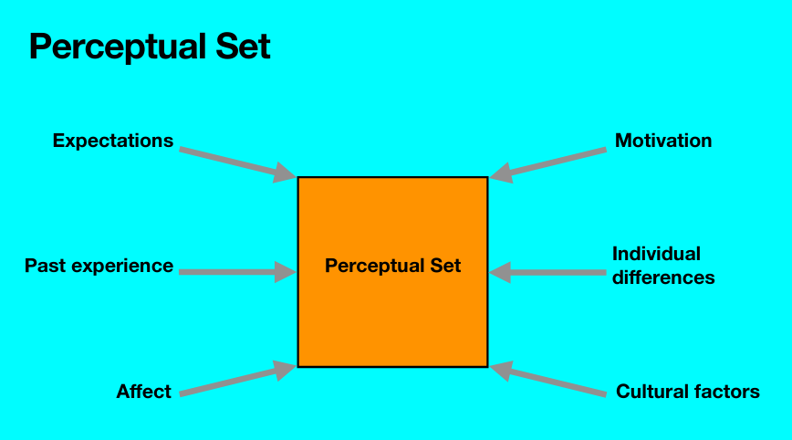

# Exercise 1
**What is the 'perceptual set' and which factors go into defining this?**

# Exercise 2
**What characterizes the gestalt laws of perception, discuss in the groups and find user interface examples of these:**

- Proximity
- Continuity
- Similarity
- Closure

# Exercise 3
**What is affordance?**

An affordance is a resource that the environment offers an animal and...
...the animal must possess the capabilities to perceive and use the resource.

# Exercise 4
**Find good and bad examples of affordances in everyday objects (one example per group member) and take turns describing them. Why are these good or bad?**

