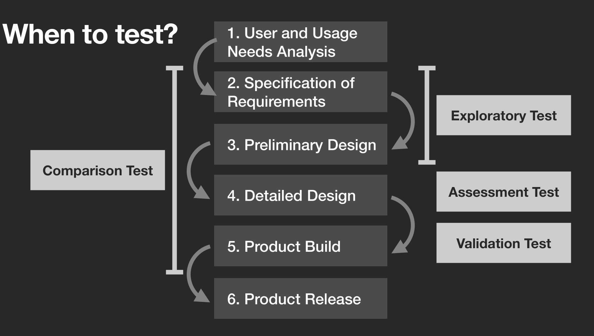
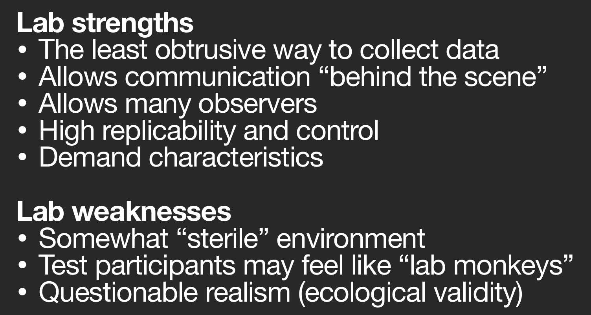

# Exercise 1
The official ISO-9241 definition describes a quality in the UI design as:

> The effectiveness, efficiency and satisfaction with which specified users achieve specified goals in particular environments

- How is effectiveness defined? And which metric(s) can be used to measure this?
- How is efficiency defined? And which metric(s) can be used to measure this?
- How is satisfaction defined? And which metric(s) can be used to measure this?

# Exercise 2
Describe how the concepts in Jakob Nielsen's and the ISO definitions are related

Jakob goes into a little more detail by splitting some of the concepts. He also makes it much more understandable to read.

# Exercise 3
What is the purpose and outcomes of conducting a usability test?

To find problems in your system or find the direction for which your system should take.

# Exercise 4
What types of different usability tests do Rubin and Chisnell suggest using in the stages of a development process?

What is the purpose and outcome of these different tests?

### Exploratory Test
Formative test early models of the product to find which direction the product should i.e. what features to have and not to have the look and feel of the product, so on and so forth.

### Assessment Test
Summative test where we actually measure usability, and how well the user can complete tasks.

### Validation Test
Validation test is the final kind of test where we might have fixed some of the issues that was found in the assessment test. If this test goes well the product can be released.

### Comparison Test
Something that we can do throughout the whole process where we show to versions of the system and the user can say which they like better and it might help them express what they want from the system or what they do not want from the system.

# Exercise 5
What are the advantages and disadvantaget of heuristic evaluation? And for user-based tasts?

### Heuristic evaluation
We have an easy, well tested and repeatable way to test the system, but we can have a habit of going into details which the user does not notice or deem a problem area.

### User test

# Exercise 6
What are the main differences between lab tests and field tests?

What are the pros and cons of lab and field tests?

# Make a test plan
Choose a system that you use on a regular basis and develop a test plan for it including the parts below. Note that you will be using this test plan to conduct a user-based usability test with 1-2 fellow students during the next exercise session:

I will choose vim (neovim).

1. Describe the context of use. What are the key considerations for your chosen system (and in general)?

    The system is used for text editing, for most people basic text editing, for me most text editing. A lot of people related it coding, however it is just made for text editing.

2. Describe your plan for including test participants (imagine the ideal case, i.e. if you weren’t constrained by having to use fellow students due to the pandemic). What are the key considerations for your chosen system (and in general)?

    In think for vim there is probably two types of users that would benefit a lot from it. Programmers probably most of since they often edit text in more advanced ways than replacing a sentence with another or moving a whole paragraph. However, i also feel like testing writers or journalist would be good as vim as they might need to change a lot of things when writing mockups.

3. Create a set of at least five test tasks. What are the key considerations for your chosen system (and in general)?

    Seeing as vim as all about editing the writing part should not really be part of the system, however you could write a lot of small exercise like the ones in vimtutor.

    More advanced exercises could be.

    - make a repeatable macro which prefixes each line with a hyphen
    - use search and replace to find every instance of "dog" and replace with "cat"
    - Use visual mode to delete a column in your markdown table

4. Make a plan of your evaluation metrics and how you would collect data during the tests including necessary equipment for gathering these metrics. What are the key considerations for your chosen system (and in general)?
5. Who will take on what role(s) during the test? What are the key considerations for your chosen system (and in general)?

    I think time to completion would be pretty good, as well as number of key presses. How much that had to look for help and how frustrated they become throughout the test.

# Conduct a heuristic inspection
Conduct a Heuristic Inspection of the system you chose in the previous exercise, i.e. do a systematic walk-through of the system and discuss how it fulfills (or not) Molich & Nielsen's 9 heuristics for usability.

Do not really fill like doing it, but have a feeling that vim would perform pretty poorly, seeing as the learning curve is so steep.
