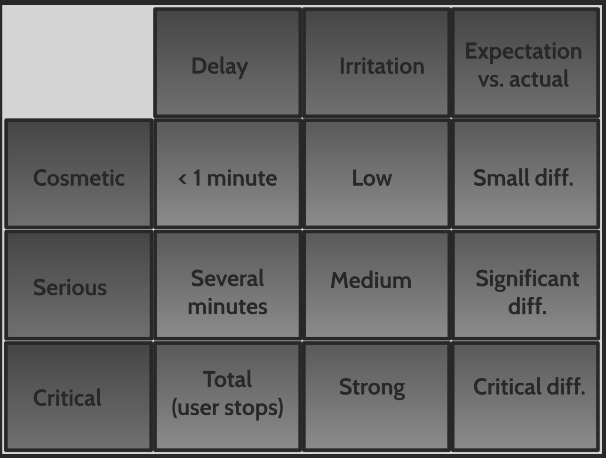
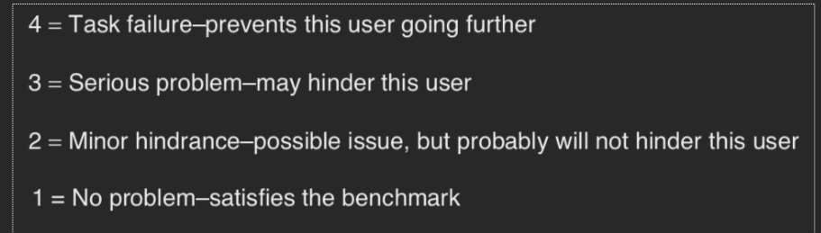

# Exercise 2
When analysing video data from a user-based think-aloud test, what user behaviour should we consider when for identifying usability problems?

The user...
- is delayed or prevented in completing a task
- feels frustrated
- makes mistakes
- misses important information
- stops talking
- is confused or surprised (mental model?)
- changes strategy or approach
- asks for help
- makes negative comments

# Exercise 3
What is a log file?

- Simplified transcription of the evaluation
- Captures the user interaction in textual form
- provides overview and "filtered detail"
- relation between time, events, and usability problems
- specialized tools exists - but a table in word will do
- can be created "live" during tests, and finished from video recordings

What is the main purpose of a log file?

I think it is just a quick way to get a detailed overview of what exactly happened in each test.

# Exercise 4
How do we describe usability problems?

The problem list is the primary outcome from an evaluation
- A ranked, and numbered, list of usability problems
- Indicates how many users experienced the problem (and who)
- Indicates where in the system the problem was experienced
- Describes each identified usability problem in detail and with brief examples
- The problem/description may go across several tasks
- May be divided into two lists: 1) overview and 2) detail

We also categorize problems

# Exercise 5
How do we categorize the severity of usability problems?

# Exercise 6
How do members on a development project prioritize which usability problems to fix?

It all depends on how sever the problem is and how often it will occur. Some small minority might not be able to complete certain tasks, but they make up such a small percentage of the user base that other less sever problems will be fixed first. Mathematically we can represent it as follows:

    $criticality = severity + probability of occurrence$

# Exercise 7
What do we consider to be good characteristics of test moderator behaviour during user-based think-aloud usability tests?

- Solid knowledge about usability
- fast learner
- can establish good relations to subjects
- good memory
- good at listening
- good at communicating
- can handle uncertainty
- flexible and capable of improvising
- can stay alert for a long time
- can maintain an overview

What would be typical problematic behaviours of a test moderator?

- controlling rathor than supporting
- too focused on data collection
- sticks too close to test plan
- appears better knowing
- does not establish good relations
- jumps to conclusions

# Exercise 8
Find one example of a user interface design per group (website, app etc.) where you have experienced a usability problem.

Describe the problem. Why is this a usability problem?

On mentordanmark half the website is made for mobile phones. This is a problem seeing as you have to write a good amount of text on the website, and thus a pc would be the preferred method of use, but this leads to annoying navigation on the site.

Categorize the severity of the problem. Why this categorization?

At the core it is only cosmetic problem seeing as the navigation is not a new concept i just have to do swiping motions with my mouse. I would however, raise it to critical seeing as this is a problem that many people must experience.

# Exercise 9
Using Balsamiq or pen and paper, make a redesign that solves the specific usability problem discussed in the exercise above.

What kind of usability test would be suitable for evaluating your design in the current stage (sketch or wireframe)?
